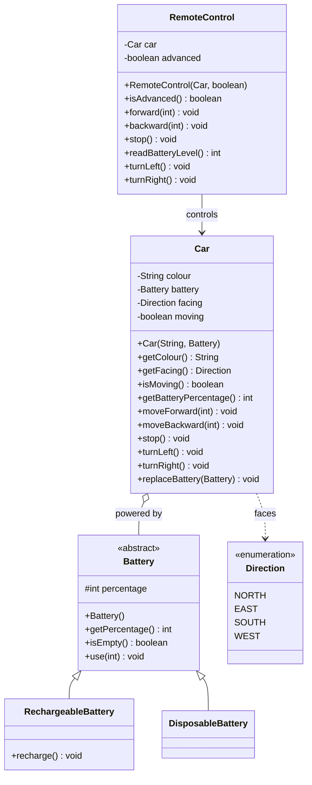

# Exercise 2 — Remote Controlled Car

Class diagram designed **before** writing any code, from the user stories in [[README]].

## User stories → design decisions

| User story | Where it lives |
|---|---|
| Decide the colour of the car | `Car.colour`, set when the car is built |
| Choose rechargeable or disposable batteries | `RechargeableBattery` / `DisposableBattery`, both a kind of `Battery` |
| Choose a simple or advanced remote control | `RemoteControl.advanced`, set when the remote is built |
| See the battery percentage remaining | `Battery.getPercentage()`, passed on by `Car` and `RemoteControl` |
| Move forward / backward a specific distance | `Car.moveForward(int)` / `Car.moveBackward(int)` |
| Stop the car from moving | `Car.stop()` |
| Turn the car left and right | `Car.turnLeft()` / `Car.turnRight()`, only reachable through an advanced remote |
| Replace the battery with either kind | `Car.replaceBattery(Battery)` — takes any `Battery`, so either subclass fits |

## Diagram

## Encapsulation notes

- Each class has one job: `Battery` knows about charge, `Car` knows about driving, `RemoteControl` knows about sending commands.
- Fields are hidden (`private`, or `protected` on `Battery` so its two subclasses can use it); the only way to change a car or a battery is through its own methods.
- The battery rule lives inside the car: `moveForward` / `moveBackward` use up the battery, and a car with an empty battery simply doesn't move.
- `Battery` is abstract: it holds what every battery has (a percentage that can be used up), and the two real batteries extend it. Only `RechargeableBattery` has a `recharge()` method, so a disposable battery cannot be recharged by mistake.
- A simple remote and an advanced one are the same class with a different flag — `turnLeft()` / `turnRight()` only do something on an advanced remote.
