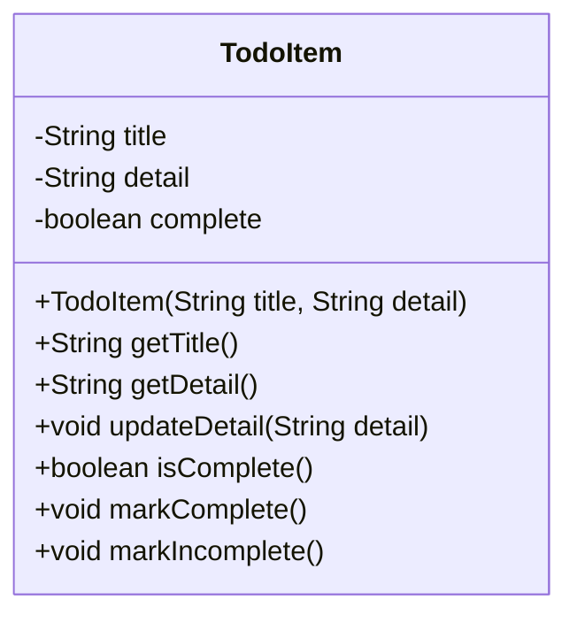

# TodoItem — Abstraction (Exercise 1)

Refactor of `TodoItem` so that no implementation detail leaks out.

## Why the original is bad

- `title`, `detail` and `status` are `public`: any class can reach in and change them.
- `status` is a `String`: the user of the class must know the magic values (`"complete"`? `"done"`? `"COMPLETE"`?).
- `setStatus(String)` / `getStatus()` force the caller to know how state is stored.

## After: hide the state, expose intent

The state stays `private`; the public interface only talks about *what* you want to do
(`markComplete`, `markIncomplete`, `isComplete`), never about *how* it is stored.

## Public interface

| Method | Meaning |
| --- | --- |
| `getTitle()` | The title of the item. |
| `getDetail()` | The description of the item. |
| `updateDetail(String)` | Change the description. |
| `isComplete()` | `true` when the item is done. |
| `markComplete()` | Mark the item as done. |
| `markIncomplete()` | Mark the item as not done yet. |

A new item is **incomplete** by default, so the caller never has to supply a status string.

Because `complete` is private, we could later swap the `boolean` for an enum
(`TODO`, `IN_PROGRESS`, `DONE`) without breaking a single line of calling code.

## Related

- [[README]] — the exercise brief.
