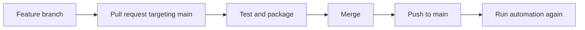

# CI-CD intro

## Why automate a working local build?

A developer can run tests and build a JAR on their own machine. The limitation is consistency: another developer can forget a command, use a different Java version, or merge code that was never checked from a clean checkout.

A pipeline is a repeatable sequence of commands that runs in a fresh environment. GitHub Actions provides that environment, called a **runner**, and reports whether each command passed or failed.

## What is CI/CD?

### Continuous Integration

> [!note]
> **Continuous Integration (CI)** automatically builds, tests, and validates code changes as developers integrate them into a shared repository.

The short feedback loop is the main benefit:

1. push a change or open a pull request
2. run the same checks in a clean runner
3. inspect the result before merging

### Continuous Delivery and Continuous Deployment

**Continuous Delivery** keeps a tested build ready for release, but a person still approves the production release.

**Continuous Deployment** goes one step further and automatically releases every change that passes the pipeline.

Automation becomes delivery only when it publishes a verified artefact. It becomes deployment only when it moves that artefact into a running environment.

## Map the project commands to pipeline stages

A Java pipeline can map familiar local commands to repeatable stages.

| Pipeline stage | Mechanism | Command or action | Observable result |
| :--- | :--- | :--- | :--- |
| Source | Repository checkout | Get the selected revision | Repository files are available on the runner |
| Runtime | Java setup | Install the required JDK | The expected Java version is available |
| Test | Gradle Wrapper | `./gradlew test` | Automated tests pass or the job stops |
| Package | Gradle Wrapper | `./gradlew bootJar` | An executable Spring Boot JAR is built |

The **Gradle Wrapper** is the repository's `gradlew` script and wrapper files. It gives the runner the project's configured Gradle version, so Gradle does not need to be installed separately.

The equivalent local build is:

```sh file:"Verify and package the application"
./gradlew clean test bootJar
```

Gradle resolves task dependencies automatically. If compilation or a test fails, the command exits unsuccessfully and later workflow steps do not run.

## How GitHub finds the workflow

GitHub scans `.github/workflows/` for files ending in `.yml` or `.yaml`.

```text
project/
└── .github/
    └── workflows/
        └── pr-validation.yaml
```

One common branch flow is:



![[CI-CD with GitHub automation|800]]

## Decision boundary

Run the Gradle commands locally while developing because that gives the fastest feedback. Use GitHub Actions to enforce the same checks from a clean checkout before and after a merge. Add a publishing or deployment mechanism only when the pipeline must move a verified artefact to another system.

---

# Links
![[Lessons/2 - Java Back-end/Day 17/__blocks/Links]]
