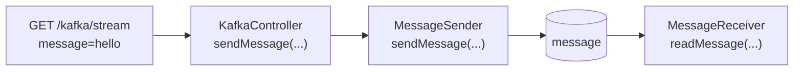
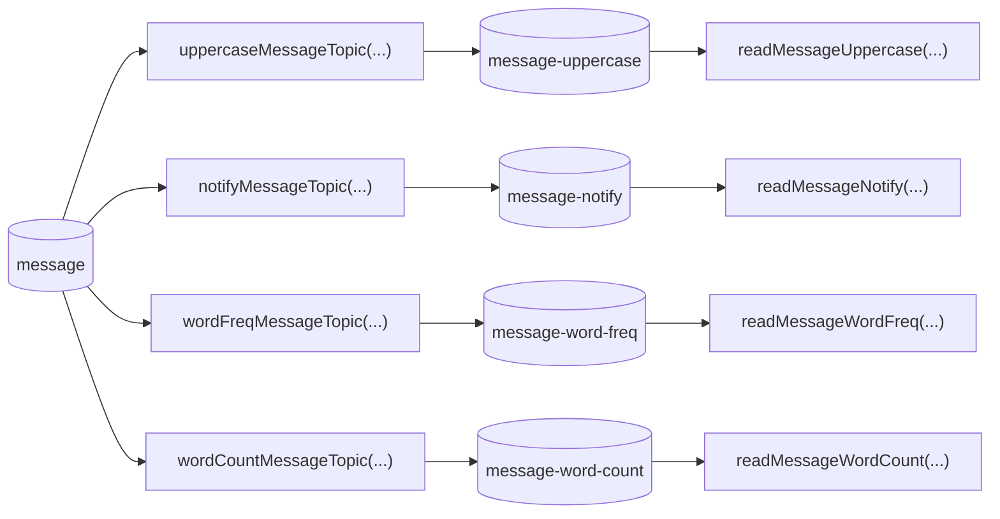
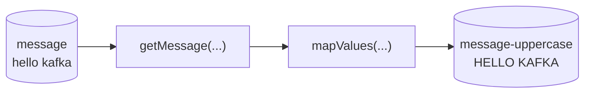
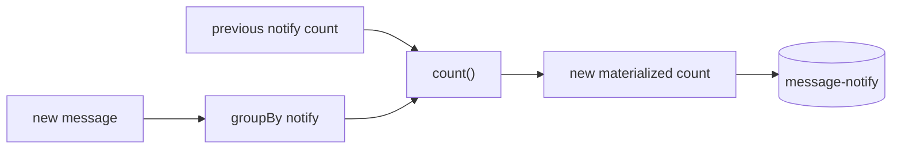
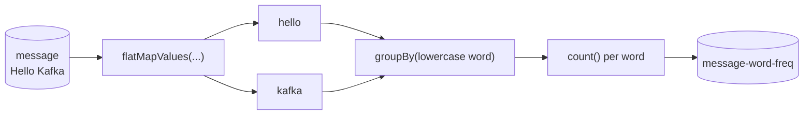
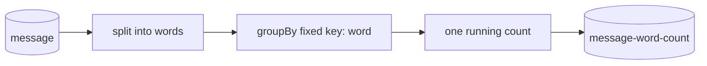

# Kafka Streams and materialized values

## Create a brand-new project

Run the build command before adding any Kafka code:

```sh file:"Create a new JavaKafkaStreams project"
spring init \
  --type=gradle-project \
  --language=java \
  --boot-version=4.1.1 \
  --group-id=dev.wows.buk \
  --artifact-id=JavaKafkaStreams \
  --name=JavaKafkaStreams \
  --package-name=dev.wows.buk.JavaKafkaStreams \
  --java-version=21 \
  --dependencies=web,devtools,kafka,kafka-streams \
  --extract \
  JavaKafkaStreams
```

Enter the new project:

```sh file:"Enter the new project"
cd JavaKafkaStreams
```

Use [[Lessons/2 - Java Back-end/Day 18/Arguments/1 - Devbox and project setup#Add the Kafka development environment|the previous lesson's Kafka development-environment setup]] only to create `devbox.json` and `process-compose.yaml` in this new project. Do not continue, copy or modify the Day 18 project.

## Extend the application configuration for Streams

Kafka Streams needs an application identity and state-store settings. Replace the base file with this complete version:

```yaml file:application.yaml group:kafka-streams
server:
  port: 4000
spring:
  web:
    error:
      include-message: always
      include-binding-errors: always
      include-stacktrace: never
      include-exception: false
  kafka:
    bootstrap-servers: "localhost:9092"
    consumer:
      group-id: demo
      auto-offset-reset: earliest
    streams:
      application-id: "kafka-stream"
      state-store-cache-max-size: 0
      state-dir: .kafka-streams
      properties:
        dsl:
          store:
            suppliers:
              class: org.apache.kafka.streams.state.BuiltInDslStoreSuppliers$InMemoryDslStoreSuppliers
```

`application-id` identifies this Streams application and prefixes its internal topics. Disabling the state-store cache makes count updates observable immediately. The state directory holds local Streams metadata, while the configured supplier keeps the teaching example's stores in memory.

## Starting point

Before adding stateful operations, rebuild the smallest HTTP to Kafka path inside this new project:



Kafka Streams adds four output paths beside the plain listener:



Each iteration follows the same order:

1. extend `StreamTopics.java`
2. add one topology method to `MessageKafkaTopology.java`
3. add the matching receiver method
4. identify the sender and controller methods that feed the input topic
5. send a message and observe the new output

# Iteration 1: uppercase messages

This iteration adds the first stream from end to end.

| File | Method used or added |
| --- | --- |
| `StreamTopics.java` | add `messageTopic()` and `messageUppercateTopic()` |
| `MessageKafkaTopology.java` | add `getMessage(...)` and `uppercaseMessageTopic(...)` |
| `MessageSender.java` | add `MessageSender(...)` and `sendMessage(...)` |
| `MessageReceiver.java` | add `readMessage(...)` and `readMessageUppercase(...)` |
| `KafkaController.java` | add `KafkaController(...)` and `sendMessage(...)` |

## 1. Extend the topic configuration

The complete current version of `StreamTopics.java` contains the original input topic and the new uppercase output topic:

```java file:StreamTopics.java group:uppercase
package dev.wows.buk.JavaKafkaStreams.kafka.topics;

import org.apache.kafka.clients.admin.NewTopic;
import org.springframework.context.annotation.Bean;
import org.springframework.context.annotation.Configuration;
import org.springframework.kafka.config.TopicBuilder;

@Configuration
public class StreamTopics {

    public static final String
        MESSAGE = "message",
        MESSAGE_UPPERCASE = "message-uppercase";

    @Bean
    NewTopic messageTopic() {

        return TopicBuilder
                .name(MESSAGE)
                .partitions(1)
                .replicas(1)
            .build();
    }

    @Bean
    NewTopic messageUppercateTopic() {

        return TopicBuilder
                .name(MESSAGE_UPPERCASE)
                .partitions(1)
                .replicas(1)
            .build();
    }
}
```

The input remains `message`. The new `message-uppercase` topic stores the transformed output. Later iterations modify this complete file by adding named constants and methods.

## 2. Create the topology

Create `src/main/java/dev/wows/buk/JavaKafkaStreams/kafka/topology/MessageKafkaTopology.java`:

```java file:MessageKafkaTopology.java group:uppercase
package dev.wows.buk.JavaKafkaStreams.kafka.topology;

import org.apache.kafka.common.serialization.Serdes;
import org.apache.kafka.streams.StreamsBuilder;
import org.apache.kafka.streams.kstream.Consumed;
import org.apache.kafka.streams.kstream.KStream;
import org.apache.kafka.streams.kstream.Produced;
import org.springframework.context.annotation.Bean;
import org.springframework.context.annotation.Configuration;
import org.springframework.kafka.annotation.EnableKafkaStreams;

import dev.wows.buk.JavaKafkaStreams.kafka.topics.StreamTopics;

@Configuration
@EnableKafkaStreams
public class MessageKafkaTopology {

    @Bean
    KStream<String, String> uppercaseMessageTopic(StreamsBuilder builder) {

        KStream<String, String> message = getMessage(builder);

        message
            .mapValues(v -> v.toUpperCase())
            .to(
                StreamTopics.MESSAGE_UPPERCASE,
                Produced.with(Serdes.String(), Serdes.String())
            );

        return message;
    }

    private KStream<String, String> getMessage(StreamsBuilder builder) {

        return builder
            .stream(
                StreamTopics.MESSAGE,
                Consumed.with(Serdes.String(), Serdes.String())
            )
            .filter((k, v) -> v != null && !v.isBlank());
    }
}
```

`@EnableKafkaStreams` activates the Streams infrastructure. Spring supplies `StreamsBuilder`, and `getMessage(...)` uses it to read string keys and values from `message`. The shared filter removes null and blank values.

`uppercaseMessageTopic(...)` calls that source method, transforms each value with `mapValues(...)`, and writes it to `message-uppercase`. This transformation is **stateless** because it needs only the current record.



## 3. Show the complete sender and receiver

Create the complete `MessageSender.java` file:

```java file:MessageSender.java group:uppercase
package dev.wows.buk.JavaKafkaStreams.kafka;

import org.springframework.kafka.core.KafkaTemplate;
import org.springframework.stereotype.Service;

import dev.wows.buk.JavaKafkaStreams.kafka.topics.StreamTopics;

@Service
public class MessageSender {

    private final KafkaTemplate<String, String> kafkaTemplate;

    public MessageSender(KafkaTemplate<String, String> kafkaTemplate) {
        this.kafkaTemplate = kafkaTemplate;
    }

    public String sendMessage(String message) {

        kafkaTemplate.send(StreamTopics.MESSAGE, message);

        return "sent: " + message;
    }
}
```

`sendMessage(...)` remains the single producer method. It publishes only to `message`; the topology reads that input and creates the derived output.

The complete current version of `MessageReceiver.java` includes both the existing plain listener and the new uppercase listener:

```java file:MessageReceiver.java group:uppercase
package dev.wows.buk.JavaKafkaStreams.kafka;

import org.springframework.kafka.annotation.KafkaListener;
import org.springframework.stereotype.Component;

import dev.wows.buk.JavaKafkaStreams.kafka.topics.StreamTopics;

@Component
public class MessageReceiver {

    @KafkaListener(topics = StreamTopics.MESSAGE)
    public void readMessage(String message) {

        System.out.println(
            "Plain message: " + message
        );
    }

    @KafkaListener(topics = StreamTopics.MESSAGE_UPPERCASE)
    public void readMessageUppercase(String message) {

        System.out.println(
            "Uppercase message: " + message
        );
    }
}
```

`readMessage(...)` consumes the plain input. `readMessageUppercase(...)` consumes the topology's output. Later iterations add named methods inside this complete receiver class.

## 4. Show the complete controller and verify the slice

Create the complete `KafkaController.java` file:

```java file:KafkaController.java group:uppercase
package dev.wows.buk.JavaKafkaStreams.controller;

import org.springframework.web.bind.annotation.GetMapping;
import org.springframework.web.bind.annotation.RequestMapping;
import org.springframework.web.bind.annotation.RequestParam;
import org.springframework.web.bind.annotation.RestController;

import dev.wows.buk.JavaKafkaStreams.kafka.MessageSender;

@RestController
@RequestMapping("kafka/stream")
public class KafkaController {

    private final MessageSender messageSender;

    public KafkaController(MessageSender messageSender) {
        this.messageSender = messageSender;
    }

    @GetMapping
    public void sendMessage(@RequestParam String message) {

        messageSender.sendMessage(message);
    }
}
```

`sendMessage(...)` delegates to the sender. It does not return the sender's string, so the successful HTTP response has an empty body.

In Postman, send a **GET** request to `http://localhost:4000/kafka/stream` with `message` = `hello kafka` in **Params**.

The log should include both results. Their order can vary because the listeners run independently:

```text
Plain message: hello kafka
Uppercase message: HELLO KAFKA
```

The first stream circle is now closed across topic configuration, topology, sender, receivers and controller.

All five Java files in this slice have been shown in full. The next iterations show named additions to these existing files. When `WordFrequencyReceiver.java` is introduced later, its complete source is included.

# Iteration 2: count notifications

This iteration introduces the first **stateful** stream. Name the methods before changing the files:

| File | Method used or added |
| --- | --- |
| `StreamTopics.java` | add `messageNotifyTopic()` |
| `MessageKafkaTopology.java` | add `notifyMessageTopic(...)` |
| `MessageSender.java` | reuse `sendMessage(...)` |
| `MessageReceiver.java` | add `readMessageNotify(...)` |
| `KafkaController.java` | reuse `sendMessage(...)` |

## 1. Add the notification topic

Add `MESSAGE_NOTIFY` to the topic-name declaration:

```java file:StreamTopics.java group:notification-count
public static final String
    MESSAGE = "message",
    MESSAGE_NOTIFY = "message-notify",
    MESSAGE_UPPERCASE = "message-uppercase";
```

Add the matching topic method between `messageTopic()` and `messageUppercateTopic()` in `StreamTopics`:

```java file:StreamTopics.java group:notification-count
@Bean
NewTopic messageNotifyTopic() {

    return TopicBuilder
            .name(MESSAGE_NOTIFY)
            .partitions(1)
            .replicas(1)
        .build();
}
```

## 2. Add the notification topology method

Add the `Grouped` import to `MessageKafkaTopology.java`:

```java file:MessageKafkaTopology.java group:notification-count
import org.apache.kafka.streams.kstream.Grouped;
```

Then add `notifyMessageTopic(...)` before `getMessage(...)` inside the class:

```java file:MessageKafkaTopology.java group:notification-count
@Bean
KStream<String, String> notifyMessageTopic(StreamsBuilder builder) {

    KStream<String, String> message = getMessage(builder);

    message
        .groupBy(
            (k, v) -> "notify",
            Grouped.with(Serdes.String(), Serdes.String())
        )
        .count()
        .toStream()
        .mapValues(c -> "New notify: " + c)
        .to(
            StreamTopics.MESSAGE_NOTIFY,
            Produced.with(Serdes.String(), Serdes.String())
        );

    return message;
}
```

`groupBy(...)` assigns every input record the fixed key `"notify"`. Because every record belongs to one group, `count()` maintains one running total.

The latest stored result is a **materialized value**. Each new input updates the previous count instead of recalculating the complete topic.



## 3. Add the notification receiver

Add `readMessageNotify(...)` to `MessageReceiver`:

```java file:MessageReceiver.java group:notification-count
@KafkaListener(topics = StreamTopics.MESSAGE_NOTIFY)
public void readMessageNotify(String message) {

    System.out.println(
        "Notify message: " + message
    );
}
```

`MessageSender.sendMessage(...)` and `KafkaController.sendMessage(...)` need no changes. Sending three HTTP requests now produces notification values equivalent to:

```text
Notify message: New notify: 1
Notify message: New notify: 2
Notify message: New notify: 3
```

# Iteration 3: count each word

This iteration creates one materialized count for every distinct word.

| File | Method used or added |
| --- | --- |
| `StreamTopics.java` | add `messageWordFreqTopic()` |
| `MessageKafkaTopology.java` | add `wordFreqMessageTopic(...)` |
| `MessageSender.java` | reuse `sendMessage(...)` |
| `WordFrequencyReceiver.java` | add `onPartitionsAssigned(...)` and `readMessageWordFreq(...)` |
| `KafkaController.java` | reuse `sendMessage(...)` |

## 1. Add the compacted frequency topic

Add `MESSAGE_WORD_FREQ` to the current topic-name declaration:

```java file:StreamTopics.java group:word-frequency
public static final String
    MESSAGE = "message",
    MESSAGE_NOTIFY = "message-notify",
    MESSAGE_UPPERCASE = "message-uppercase",
    MESSAGE_WORD_FREQ = "message-word-freq";
```

Add `messageWordFreqTopic()` to `StreamTopics`:

```java file:StreamTopics.java group:word-frequency
@Bean
NewTopic messageWordFreqTopic() {

    return TopicBuilder
            .name(MESSAGE_WORD_FREQ)
            .partitions(1)
            .replicas(1)
            .compact()
        .build();
}
```

`.compact()` configures Kafka to retain the latest value for each key while older values for that key can be removed.

## 2. Add the word-frequency topology method

Add these imports to `MessageKafkaTopology.java`:

```java file:MessageKafkaTopology.java group:word-frequency
import java.util.Arrays;

import org.apache.kafka.streams.KeyValue;
```

Then add `wordFreqMessageTopic(...)` before `getMessage(...)`:

```java file:MessageKafkaTopology.java group:word-frequency
@Bean
KStream<String, String> wordFreqMessageTopic(StreamsBuilder builder) {

    KStream<String, String> message = getMessage(builder);

    message
        .flatMapValues(v -> Arrays.asList(v.split("\\W+")))
        .filter((k, v) -> v != null && !v.isBlank())
        .groupBy(
            (k, word) -> word.toLowerCase(),
            Grouped.with(Serdes.String(), Serdes.String())
        )
        .count()
        .toStream()
        .map((word, c) -> KeyValue.pair(word, String.valueOf(c)))
        .to(
            StreamTopics.MESSAGE_WORD_FREQ,
            Produced.with(Serdes.String(), Serdes.String())
        );

    return message;
}
```

`flatMapValues(...)` turns one sentence into one record per word. The lowercased word becomes the group key, so equal words update the same materialized count.



## 3. Add the dedicated frequency receiver

Create `src/main/java/dev/wows/buk/JavaKafkaStreams/kafka/WordFrequencyReceiver.java`:

```java file:WordFrequencyReceiver.java group:word-frequency
package dev.wows.buk.JavaKafkaStreams.kafka;

import java.util.HashMap;
import java.util.Map;

import org.apache.kafka.clients.consumer.ConsumerRecord;
import org.apache.kafka.common.TopicPartition;
import org.springframework.kafka.annotation.KafkaListener;
import org.springframework.kafka.listener.AbstractConsumerSeekAware;
import org.springframework.stereotype.Component;

import dev.wows.buk.JavaKafkaStreams.kafka.topics.StreamTopics;

// Dedicated seek-aware component: only the word-frequency listener is rewound on assignment
@Component
public class WordFrequencyReceiver extends AbstractConsumerSeekAware {

    private final Map<String, Long> wordsFreq = new HashMap<>();

    @Override
    public void onPartitionsAssigned(
        Map<TopicPartition, Long> assignments,
        ConsumerSeekCallback callback
    ) {
        super.onPartitionsAssigned(assignments, callback);

        wordsFreq.clear();
        callback.seekToBeginning(assignments.keySet());
    }

    @KafkaListener(topics = StreamTopics.MESSAGE_WORD_FREQ)
    public void readMessageWordFreq(ConsumerRecord<String, String> wordFreq) {

        wordsFreq.put(wordFreq.key(), Long.valueOf(wordFreq.value()));

        System.out.println(
            "Full words frequency: " + wordsFreq
        );
    }
}
```

`readMessageWordFreq(...)` needs `ConsumerRecord<String, String>` because the word is the record key and its current count is the value. `Map.put(...)` adds a word or replaces its earlier count.

The Java map is only an in-memory view. `onPartitionsAssigned(...)` clears that view and seeks to the beginning of the compacted output topic. Replaying the retained updates rebuilds the latest count for every retained word key.

`MessageSender.sendMessage(...)` and `KafkaController.sendMessage(...)` still feed the same `message` input topic. For `hello kafka world` followed by `hello kafka streams`, the final values are:

| Word | Count |
| --- | ---: |
| `hello` | 2 |
| `kafka` | 2 |
| `world` | 1 |
| `streams` | 1 |

# Iteration 4: count all words

The final iteration keeps one total across every word in every message.

| File | Method used or added |
| --- | --- |
| `StreamTopics.java` | add `messageWordCountTopic()` |
| `MessageKafkaTopology.java` | add `wordCountMessageTopic(...)` |
| `MessageSender.java` | reuse `sendMessage(...)` |
| `MessageReceiver.java` | add `readMessageWordCount(...)` |
| `KafkaController.java` | reuse `sendMessage(...)` |

## 1. Complete the topic configuration

Add `MESSAGE_WORD_COUNT`. The finished topic-name declaration now matches the completed project:

```java file:StreamTopics.java group:word-count
public static final String
    MESSAGE = "message",
    MESSAGE_NOTIFY = "message-notify",
    MESSAGE_UPPERCASE = "message-uppercase",
    MESSAGE_WORD_FREQ = "message-word-freq",
    MESSAGE_WORD_COUNT = "message-word-count";
```

Add `messageWordCountTopic()`:

```java file:StreamTopics.java group:word-count
@Bean
NewTopic messageWordCountTopic() {

    return TopicBuilder
            .name(MESSAGE_WORD_COUNT)
            .partitions(1)
            .replicas(1)
        .build();
}
```

## 2. Add the total-word topology method

Add `wordCountMessageTopic(...)` before `getMessage(...)` in `MessageKafkaTopology`:

```java file:MessageKafkaTopology.java group:word-count
@Bean
KStream<String, String> wordCountMessageTopic(StreamsBuilder builder) {

    KStream<String, String> message = getMessage(builder);

    message
        .flatMapValues(v -> Arrays.asList(v.split("\\W+")))
        .filter((k, v) -> v != null && !v.isBlank())
        .groupBy(
            (k, v) -> "word",
            Grouped.with(Serdes.String(), Serdes.String())
        )
        .count()
        .toStream()
        .map((k, c) -> KeyValue.pair(k, "Words along all messages are: " + c))
        .to(
            StreamTopics.MESSAGE_WORD_COUNT,
            Produced.with(Serdes.String(), Serdes.String())
        );

    return message;
}
```

The split is the same as the frequency method, but every word now receives the fixed key `"word"`. One group therefore maintains one total.



## 3. Add the word-count receiver

Add `readMessageWordCount(...)` to `MessageReceiver`:

```java file:MessageReceiver.java group:word-count
@KafkaListener(topics = StreamTopics.MESSAGE_WORD_COUNT)
public void readMessageWordCount(String count) {

    System.out.println(
        "Word count: " + count
    );
}
```

The sender and controller remain `MessageSender.sendMessage(...)` and `KafkaController.sendMessage(...)`. For `hello kafka world`, this output becomes:

```text
Word count: Words along all messages are: 3
```

After `hello kafka streams`, the same materialized count becomes:

```text
Word count: Words along all messages are: 6
```

# Verify the completed application

With Kafka and the application running, send these requests from Postman:

| Request | Params |
| --- | --- |
| `GET http://localhost:4000/kafka/stream` | `message` = `hello kafka world` |
| `GET http://localhost:4000/kafka/stream` | `message` = `hello kafka streams` |

The independent consumers can interleave their lines, but the output should contain values equivalent to:

```text
Plain message: hello kafka world
Uppercase message: HELLO KAFKA WORLD
Notify message: New notify: 1
Word count: Words along all messages are: 3

Plain message: hello kafka streams
Uppercase message: HELLO KAFKA STREAMS
Notify message: New notify: 2
Word count: Words along all messages are: 6
```

The word-frequency map should eventually contain `hello=2`, `kafka=2`, `world=1` and `streams=1`. `HashMap` does not guarantee their printed order.

## Restart check

1. Leave Kafka running
2. Stop only the Spring Boot application
3. Start the application again with `./gradlew bootRun`
4. Observe `WordFrequencyReceiver` rebuilding its map from `message-word-freq`
5. Send another message and confirm that the stream counts continue from their earlier materialized values

Use `devbox run kafka-reset` only when you deliberately want to remove the local broker data and begin again from zero. Stop the application and Kafka before resetting.

## Decision boundary

Use `@KafkaListener` when one incoming record contains everything needed for one action. Use a stateless stream operation when each output is derived only from the current record. Use a stateful Kafka Streams operation when the application must maintain a recoverable result across many records.

---

# Links
![[Lessons/2 - Java Back-end/Day 19/__blocks/Links]]
