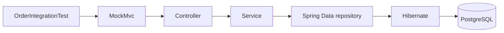
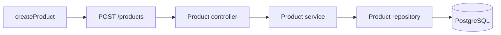

# Integration testing in Spring Boot

Unit tests can prove that a controller, service or repository behaves correctly on its own. They cannot prove that Spring creates those objects, connects them, converts JSON, runs the request through Spring MVC and persists the result in PostgreSQL.

An **integration test** exercises a connection between real parts of the application. In this lesson, each test enters through an HTTP endpoint and follows the assembled application path:



`MockMvc` keeps the HTTP transport inside the test process, but it does not replace the controller, service, repository or database with mocks.

# 1. Provide the minimum application behaviour

The application code is not the teaching focus, so it is not reproduced here. Before adding the integration test, the application must provide only this contract:

| Request | Required behaviour |
| --- | --- |
| `POST /products` with `name` and `price` | Persist the product and return `201 Created` with its generated `id` |
| `GET /products/{id}` | Return the persisted product with `200 OK` |
| `POST /orders` with `productIds` | Load every product, calculate the total from stored prices, persist the order and return `201 Created` |
| `GET /orders/{id}` | Return the persisted order with `200 OK` |
| `POST /orders` with an unknown product ID | Return `400 Bad Request` without creating an order |

The normal controller, service and Spring Data repository path must implement these behaviours. A product has an ID, name and `BigDecimal` price. An order has an ID, a collection of products and a `BigDecimal` total calculated by the service. The client sends product IDs only and never supplies the order total.

# 2. Create and configure the test class

Create `src/test/java/com/booleanuk/OrderIntegrationTest.java`. Start with the package, imports, class annotations and injected `MockMvc` field:

```java file:OrderIntegrationTest.java
package com.booleanuk;

import static org.springframework.test.web.servlet.request.MockMvcRequestBuilders.get;
import static org.springframework.test.web.servlet.request.MockMvcRequestBuilders.post;
import static org.springframework.test.web.servlet.result.MockMvcResultMatchers.jsonPath;
import static org.springframework.test.web.servlet.result.MockMvcResultMatchers.status;

import org.junit.jupiter.api.Test;
import org.springframework.beans.factory.annotation.Autowired;
import org.springframework.boot.test.context.SpringBootTest;
import org.springframework.boot.webmvc.test.autoconfigure.AutoConfigureMockMvc;
import org.springframework.http.MediaType;
import org.springframework.test.web.servlet.MockMvc;

import com.jayway.jsonpath.JsonPath;

@SpringBootTest
@AutoConfigureMockMvc
class OrderIntegrationTest {

    @Autowired
    MockMvc mockMvc;
}
```

This first version is a complete, compilable Java file. It has no test methods yet.

`@SpringBootTest` loads the complete application context. Spring creates the real controllers, services, repositories, Hibernate configuration and datasource.

`@AutoConfigureMockMvc` adds a configured `MockMvc` object to that context. `MockMvc` sends requests through Spring MVC without opening a TCP port. `@Autowired` assigns that configured object to the test field.

# 3. Create prerequisite data through the API

Add `createProduct(...)` inside `OrderIntegrationTest`:

```java file:OrderIntegrationTest.java
    /** Creates a product through the API and returns its generated id. */
    private long createProduct(String name, String price) throws Exception {

        // Build request json body
        String body = """
                {"name": "%s", "price": %s}
                """.formatted(name, price);

        // Save a new product in db from incoming parameters
        String response = mockMvc.perform(post("/products")
                        .contentType(MediaType.APPLICATION_JSON)
                        .content(body))
                .andExpect(status().isCreated()) // is product actually saved in db?

                // Then extract response in form of string
                .andReturn()
                .getResponse()
                .getContentAsString();

        // Get back with id of new product
        return ((Number) JsonPath.read(response, "$.id")).longValue();
    }
```

This private method is a setup helper, not a test method. It has no `@Test` annotation. It sends `POST /products`, checks for `201 Created`, reads the response JSON and returns the generated ID.

The helper deliberately avoids calling a repository directly:



This keeps setup inside the same integration boundary as the behaviour being tested.

# 4. Verify that the product can be retrieved

Add the first test method inside the class:

```java file:OrderIntegrationTest.java
    @Test
    void createsAProductThatCanBeRetrieved() throws Exception {

        // The helper already expects 201 Created on POST /products
        long productId = createProduct("Monitor", "249.50");

        final String expName = "Monitor";
        final double expPrice = 249.50;

        // Then check the product is actually persisted and readable through the API
        mockMvc.perform(get("/products/" + productId)) // get the new product only
                .andExpect(status().isOk()) // is the response ok?
                .andExpectAll(jsonPath("$.name").value(expName)) // is the name stored?
                .andExpect(jsonPath("$.price").value(expPrice)); // is the price stored?
    }
```

`createsAProductThatCanBeRetrieved()` uses the private helper, then performs `GET /products/{id}`. The assertions prove that the product can be read back through the API with the same name and price. The helper creates the prerequisite data; this test verifies the persisted result.

# 5. Test the successful order journey

Add the successful order test:

```java file:OrderIntegrationTest.java
    @Test
    void createsAnOrderAndSumsTheProductPrices() throws Exception {

        long keyboardId = createProduct("Keyboard", "179.99");
        long mouseId = createProduct("Mouse", "20.01");

        final double expOrderPrice = 200; // 179.99 + 20.01 = 200
        final int expProductCount = 2; // keyboard + mouse -> 2 products

        // The order is created from product ids only: no total is sent
        String body = """
                {"productIds": [%d, %d]}
                """.formatted(keyboardId, mouseId);

        // Create the order from body input
        String created = mockMvc.perform(post("/orders")
                        .contentType(MediaType.APPLICATION_JSON)
                        .content(body))

                // Then check if the response is what's expected
                .andExpect(status().isCreated()) // has the entity been created?
                .andExpect(jsonPath("$.total").value(expOrderPrice)) // is the total price correct?
                .andExpect(jsonPath("$.products.length()").value(expProductCount)) // is the amount of products consistent?

                // Then extract response in form of string
                .andReturn()
                .getResponse()
                .getContentAsString();

        // Get newly created order's id
        int orderId = JsonPath.read(created, "$.id");

        // Then check db response
        mockMvc.perform(get("/orders/" + orderId)) // get the new order only
                .andExpect(status().isOk()) // is the response ok?
                .andExpect(jsonPath("$.total").value(expOrderPrice)); // is the total price still consistent from db?
    }
```

The method creates two products through the helper and sends only their generated IDs to `POST /orders`. It does not send a total.

The response must contain `201 Created`, a calculated total of `200`, and two products. The final `GET /orders/{id}` proves that the total survives the complete save-and-read path through PostgreSQL.

There are two different JSONPath APIs in this method:

- `jsonPath(...)` is a Spring MVC result matcher used inside `.andExpect(...)`
- `JsonPath.read(...)` reads a value from a JSON string already returned by the application

# 6. Test the failure path

Add the final test method:

```java file:OrderIntegrationTest.java
    @Test
    void rejectsAnOrderWithAnUnknownProduct() throws Exception {

        // Create an order with an impossible product id
        mockMvc.perform(post("/orders")
                        .contentType(MediaType.APPLICATION_JSON)
                        .content("""
                                {"productIds": [999999]}
                                """))
                .andExpect(status().isBadRequest()); // am I getting a proper bad response?
    }
```

The request contains valid JSON but references a product that does not exist. The service must discover that through the real repository path, and the controller must translate the result into `400 Bad Request`.

# 7. Review the completed class

The completed `OrderIntegrationTest` contains four methods introduced in this order:

| Method | Role |
| --- | --- |
| `createProduct(...)` | Private setup helper that creates a product through the API |
| `createsAProductThatCanBeRetrieved()` | Verifies that a created product can be retrieved from PostgreSQL through the API |
| `createsAnOrderAndSumsTheProductPrices()` | Verifies order creation, total calculation and persisted retrieval |
| `rejectsAnOrderWithAnUnknownProduct()` | Verifies the `400 Bad Request` failure path |

The first method prepares data. The remaining three methods have `@Test`, so JUnit executes three test cases.

# 8. Run and interpret the tests

Run the integration-test class while developing it:

```sh file:"Run OrderIntegrationTest"
./gradlew test --tests com.booleanuk.OrderIntegrationTest
```

Run the complete test suite before finishing:

```sh file:"Run all tests"
./gradlew test
```

The three tests prove that products can be created and retrieved, orders calculate and persist totals from stored product prices, and unknown products produce a client error. They do not prove that a separately deployed server accepts network connections because `MockMvc` does not open a TCP port.

Use a unit test when one class or business rule can be checked in isolation. Use this wider integration test when confidence depends on Spring MVC, dependency injection, persistence and PostgreSQL working together.

---

# Links
![[Lessons/4 - Misc/Day 29/__blocks/Links]]
