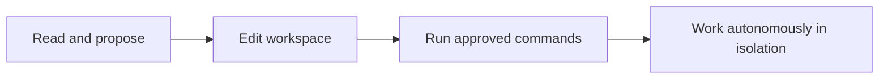
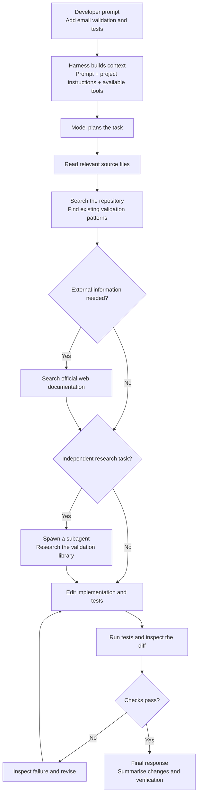

# AI Developing
![[Codex Hello Screen Cli.png]]
AI coding tools bring the model into the developer's working environment. Common examples include **OpenAI Codex**, **Claude Code**, **OpenCode**, **GitHub Copilot**, **Gemini CLI** and **Aider**. Some run primarily in a terminal, while others also provide an IDE, desktop or web interface.

These products are not simply different names for a model. Each combines one or more models with its own interface, instructions, tools, permissions and workflow. Codex can inspect a local repository and run installed commands.^[https://code.claude.com/docs/en/overview Claude Code overview]^[https://learn.chatgpt.com/docs/codex/cli Codex CLI]^[https://opencode.ai/docs OpenCode documentation]

The most useful comparison is therefore not only *which model is strongest?* It is also *how does the complete tool help the model work safely and effectively inside a real project?*

## Hardness
The software surrounding the model is commonly called the **agent harness**. It prepares the model's context, supplies its instructions, exposes tools, decides how tool results return to the model and controls the loop in which the model observes, acts and checks the outcome.

The company or community building the coding tool produces this harness. A model provider may also produce a harness, but the two remain separate: the same model can behave differently when placed in a different coding tool.

In most closed-source products, you can read the public documentation and configure the exposed settings, but you cannot inspect the complete internal instructions, context-management logic or orchestration code. An open-source tool such as OpenCode makes more of that implementation inspectable. This is why the harness is one of the most important differences between products: it determines what project information reaches the model, which actions are possible, how permission is requested and how reliably work is verified.

## Prompt
**Prompting** is communicating your intent to the model. A useful prompt normally identifies the goal, relevant context, constraints and evidence that will demonstrate success.

There is a practical trade-off. Writing a detailed specification takes time, but a vague request makes the model infer missing requirements and increases the chance of rework. Do not try to describe the complete codebase in every message. Give enough information to establish the task, then let the tool inspect the repository and ask for clarification where necessary.

```text
Weak:  Add validation.

Stronger:  Validate the registration request in the service layer.
           Follow the existing validation pattern, preserve the API response
           shape and add tests for blank email and duplicate username.
```

Prompting remains one of the least stable parts of AI development. Models and harnesses change quickly, so a technique that improves one tool or model may be unnecessary or counterproductive in another or two months later. Prefer clear engineering requirements over memorized “magic words”.

## Strategy
An AI coding strategy defines more than the first prompt. It decides how much access the tool receives, how work is divided, which project knowledge is reusable and what must be verified before a change is accepted.

The following mechanisms appear under different names across products, but they solve related problems.
### Tool Freedom
Tool freedom is a threshold between **control** and **autonomy**. At one end, the agent can only read files and propose changes. Further along, it may edit the current workspace, run approved commands, access the network or act without asking for each step.

Move this threshold according to the risk of the task and your confidence in both the repository and the agent:



A sandbox or container makes greater autonomy safer by limiting the files, processes, credentials and network resources the agent can reach. For example, you may allow an agent to install dependencies and run a test suite inside a disposable container while refusing the same freedom on your host machine. Isolation reduces the possible damage. It does not make generated commands correct or trusted, it just reduce maximum blast radius.
> [!note] Note
> At the moment of writing, the only common tools that actually comes with a containerization strategy out-of-the-box is *Codex* from *OpenAI*.
> In any case, is strongly suggest to implement a custom sandboxing strategy, in order to have full control over limitation to take in place.
### Agents
An **agent** is a model running inside a loop: it receives a goal, chooses an action, observes the result and continues until it can return an outcome. A coding session usually begins with one main agent. The user or harness may spawn a **subagent** when a task can be separated, such as researching an API, inspecting tests or reviewing a change.

Subagents can work in parallel and keep large search results or logs out of the main conversation. They can also specialise through different instructions and tool permissions.^[https://code.claude.com/docs/en/sub-agents Claude Code subagents] The costs are additional model usage, duplicated investigation and coordination risk. Two agents may make incompatible assumptions, and a summary can omit an important detail. Delegate independent, well-bounded work; keep final integration and verification under one clear owner.

### Workflow
This workflow follows one possible sequence from the developer's request to a verified result:

1. The developer asks the agent to add email validation and tests
2. The harness combines that prompt with project instructions and the tools available to the model
3. The model plans the work, reads the relevant files and searches for an existing validation pattern
4. If it needs external information, it searches official documentation. If a separate research task would help, it delegates that work to a subagent
5. The agent edits the implementation and tests, then runs the checks and inspects the resulting diff
6. A failed check returns the agent to the implementation step; when every check passes, it reports the changes and the evidence used to verify them



### Skills/Documentation
Coding agents need project knowledge that source code alone may not reveal: build commands, architecture boundaries, naming rules, security constraints and the expected definition of done. Teams increasingly keep this information in Markdown alongside the repository.

The ecosystem is fragmented. Codex reads files named `AGENTS.md`; Claude Code commonly uses `CLAUDE.md`; other tools use rule files, custom instructions or reusable **skills**. These files steer the harness by adding instructions to the model's context.^[https://learn.chatgpt.com/docs/agent-configuration/agents-md Codex AGENTS.md instructions]

Keep these documents short, concrete and maintained. Record stable facts and executable commands, not a copy of information the agent can discover from the code. Outdated instructions can consistently steer every session in the wrong direction, but it quite effortless to make model keep them updated.
### Tools
A model generates text; it does not inherently open a file, execute a test or browse the web. A **tool** is a capability that the harness exposes to the model through a defined name and input format.

Typical coding tools include:

- reading, searching and editing files;
- executing terminal commands and test suites;
- inspecting Git status and diffs;
- searching or retrieving web documentation;
- interacting with issue trackers, databases or cloud services.

The harness executes the requested operation and returns the real result to the model. This creates the agent loop: propose an action → use a tool → observe its output → decide what to do next. Tool access must be permissioned because it converts generated intent into an action on a local machine or remote system.
### MCP
**MCP**, the Model Context Protocol, is an open standard for connecting AI applications to external systems. An MCP server can expose data sources, tools and reusable workflows; an MCP client inside the coding agent discovers and invokes them.^[https://modelcontextprotocol.io/docs/2026-07-28/getting-started/intro Model Context Protocol introduction]

This gives different agents a common way to connect to services such as documentation, a browser, GitHub or a database instead of requiring a separate integration for every product. MCP standardises the connection, not the trustworthiness of the connected server. Review what an MCP server can read or change, how it authenticates and which project data it may send outside the machine.

## Capabilities
AI assistance can make development faster, but there is no honest universal percentage. The result depends on the developer, task, repository, model, harness and measurement method.

A controlled study published in 2023 asked developers to implement a JavaScript HTTP server. Participants with GitHub Copilot completed the task **55.8% faster** than the control group.^[https://arxiv.org/abs/2302.06590 The Impact of AI on Developer Productivity] This is strong evidence that assistance can accelerate a bounded, greenfield task; it does not prove the same gain for maintaining a familiar production system.

A 2026 publication combined randomised field experiments at Microsoft, Accenture and another large company, involving **4,867 developers**. Access to a coding assistant increased completed tasks by an estimated **26.08%**, although results varied between the three experiments and less-experienced developers showed greater adoption and estimated gains.^[https://doi.org/10.1287/mnsc.2025.00535 Three field experiments with software developers] This is broader workplace evidence, but completed tasks are not the same as long-term business value or software quality.

A different randomised study examined experienced open-source developers working on real issues in repositories they already knew. With early-2025 AI tools, they took **19% longer**. Before the tasks they expected AI to make them 24% faster, and afterwards still believed it had made them 20% faster.^[https://metr.org/blog/2025-07-10-early-2025-ai-experienced-os-dev-study METR early-2025 AI developer productivity study] The result shows why perceived speed is not sufficient evidence. In a 2026 update, METR said newer tools likely provide greater acceleration, but selection effects and unreliable timing made its new experiment only weak evidence for the size of that improvement.^[https://metr.org/blog/2026-02-24-uplift-update METR 2026 productivity experiment update]

The 2024 DORA report found a similarly mixed organisational picture: AI adoption was associated with greater individual productivity, flow and job satisfaction, but also with lower delivery stability and throughput.^[https://dora.dev/research/2024/dora-report 2024 DORA report] This was observational research, so it identifies relationships rather than proving that AI caused every outcome.

AI can also make you *more capable*: it can explain unfamiliar code, surface alternatives and help you work across technologies. That is not the same as making your own understanding deeper. A 2026 randomised study asked **52 developers** to work with an unfamiliar Python library. The AI-assisted group scored **50%**, compared with **67%** for the group coding without AI, on an immediate quiz covering understanding, code reading, writing and debugging; the largest gap was in debugging.^[https://arxiv.org/abs/2601.20245 How AI Impacts Skill Formation] The study was small, short and measured immediate learning in one unfamiliar library, so it does not prove that every use of AI harms learning.

If code enters the project faster than the team can explain, review and maintain it, the project may accumulate **knowledge debt**. The implementation exists, but the people responsible for it do not fully understand its assumptions or failure modes. “Knowledge debt” is a useful description of this risk, not yet a standard outcome directly established by long-term research.

Use the speed to increase engineering quality rather than to skip engineering work:

- ask the agent to explain unfamiliar decisions and alternatives
- inspect the exact diff instead of accepting a success message
- run tests, static analysis and security checks
- verify behaviour at the system boundary
- keep changes small enough to review
- reject code you cannot explain and maintain
- test and document everything with your own eyes

> [!important]
> AI output is a proposal, not proof. The useful measure is not how quickly code was generated, but how quickly the team produced a correct, understood and maintainable change.

---

# Links
![[Lessons/4 - Misc/Day 30/__blocks/Links]]
