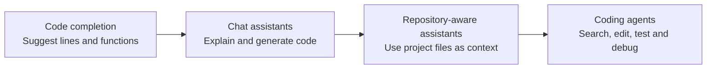

# GenAI assisted programming

## LC

### Video

> [!note]- Video
> 
 <iframe src="" frameborder="0" allowfullscreen></iframe> 

[Video link]()

### Repository

![[Claude Code Change Resume.png]]

Generative AI can help you investigate a codebase, explain unfamiliar code, propose an implementation, change files and verify the result. This is **AI-assisted programming**: the developer defines the problem and constraints, while an AI tool accelerates parts of the development process.

The developer remains responsible for the work. You must understand the proposed change, decide whether it fits the system, review the code and prove that it behaves correctly. An answer that looks convincing can still contain an incorrect assumption, an insecure implementation or code that does not compile.

> [!important]
> AI assistance does not transfer responsibility to the tool. Treat generated code as an unreviewed contribution: inspect it, run it and test it before accepting it.

![[Claude Code Fix Comment.png]]

## From code completion to coding agents

AI support for programming did not begin with one product. Developers have used automated completion and static analysis for years, but modern generative coding tools became widely visible with tools such as *GitHub Copilot* in 2021 and conversational assistants such as *ChatGPT* in 2022.

During the following three years, the way developers worked with these systems changed quickly:

The important change is not only that models can generate more code. Tools such as Codex and Claude Code can participate in a development workflow: investigate first, perform a bounded task and return evidence that the result works.

## AI assistance is not vibe coding

In vibe coding, a person may repeatedly ask an AI to change a program until it appears to work, without properly understanding the code or verifying the consequences. That approach is unreliable in a professional codebase.

An experienced AI-assisted workflow keeps normal engineering practices in place:

1. define the intended behaviour and constraints
2. give the tool the relevant project context
3. ask it to investigate or make a limited change
4. inspect the files and reasoning it produces
5. run tests and other checks
6. correct, refine or reject the result

AI increases your reach, but your programming knowledge is what lets you direct the tool, recognise weak solutions and evaluate the result.

## Model and tool are different things

A **model** is the trained system that receives input and generates output. In a coding task, its input can include your instructions, source code, documentation, earlier messages and results returned by tools. This available information is its **context**.

The model generates likely responses from that context. It does not automatically know your complete repository, your organisation's requirements or whether its answer is true. Missing or ambiguous context can produce a confident but incorrect result.

A **platform** places an interface and capabilities around a model. The same platform may offer more than one model, and the same model may be available through different tools. Model selection can affect reasoning, speed and cost; the surrounding tool determines what the model can see and do.

Two common ways to use these platforms are:

| Environment | Typical use |
| --- | --- |
| **Dashboard or chat** | Ask questions, compare approaches, explain concepts and work with code or files supplied to the conversation. |
| **Dedicated developer tool** | Work inside a repository with access to files, search, version-control information, terminal commands and test results. These tools are commonly used from the CLI or integrated into an editor. |

A dashboard is useful for discussion, but it often depends on you copying the correct context into the conversation. A CLI tool such as Codex or Claude Code works closer to the development environment. With permission, it can inspect the real project and act on it rather than only describing a possible solution.

That access makes the tool more capable and also increases the need for boundaries. Check which files it can change, which commands it may run and what information may leave your environment. Start with a clear, limited task and require verifiable results.

## Lesson

[[1 - AI Developing|AI Developing]]

## Exercise

[[Bob's Bagels - AI assisted development]]

---

# Links
![[Lessons/4 - Misc/Day 30/__blocks/Links]]
