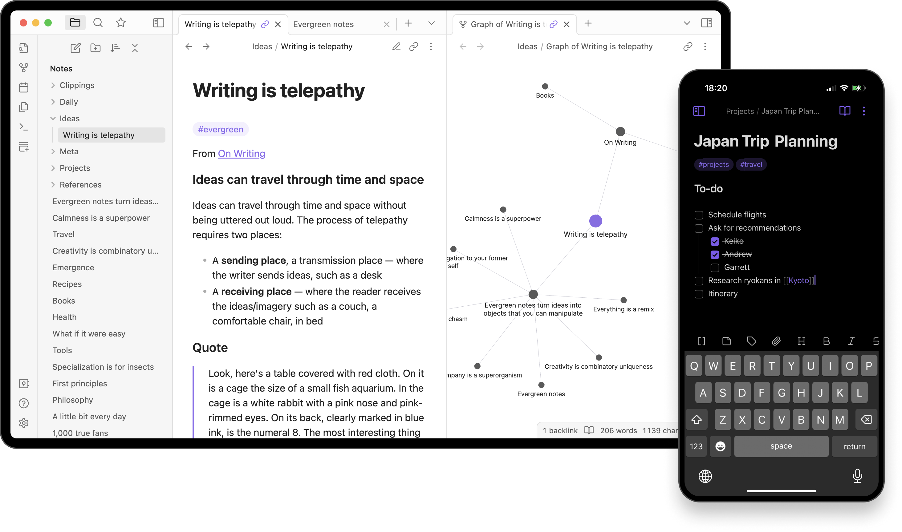
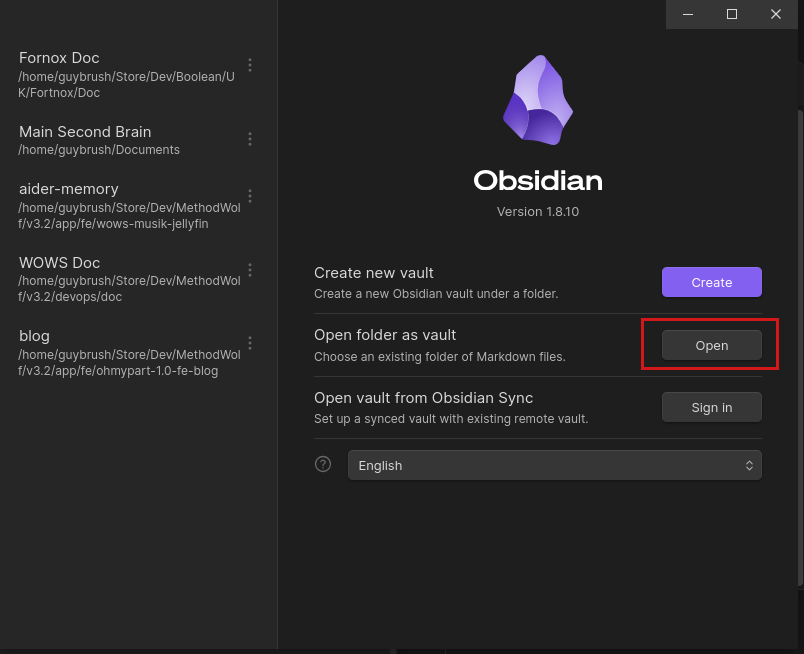
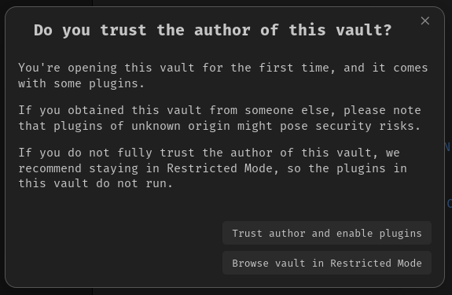

## Obsidian



This repository is built for [Obsidian.md](https://obsidian.md/). If you do not have it yet, download it through your application manager or from the Obsidian website.

## Clone repository



Clone or fork the repository, then open the downloaded folder as a vault in [Obsidian.md](https://obsidian.md/).

### Download all lesson submodules

Clone the documentation repository and every lesson repository in one command:

```sh
git clone --recurse-submodules <repository-url>
```

For example, after this repository has been pushed to GitHub:

```sh
git clone --recurse-submodules https://github.com/<owner>/boolean-uk-2-fortnox-doc.git
```

If you have already cloned the repository without its lesson content, populate every submodule with:

```sh
git submodule update --init --recursive
```

## [OPTIONAL] Obsidian plugins



For a better experience, activate the community plug-ins supplied with the vault and trust their author when Obsidian asks you to do so.
